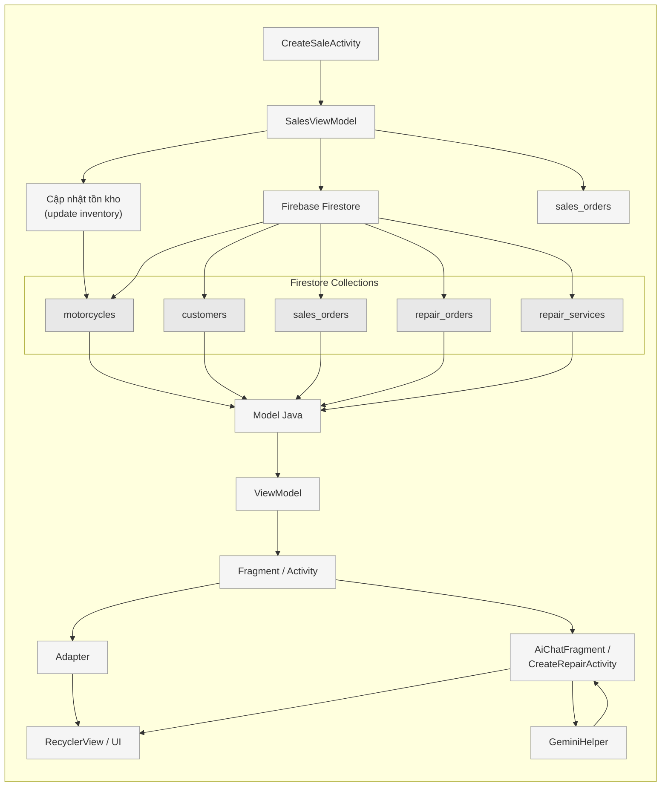

# Hình 1: Sơ đồ Kiến trúc / Luồng dữ liệu (Data Flow Architecture)

> Sơ đồ mô tả luồng dữ liệu của ứng dụng MotoShop Android theo kiến trúc MVVM, sử dụng Firebase Firestore.

## Giải thích luồng dữ liệu

| Bước | Mô tả |
|------|-------|
| 1 | `CreateSaleActivity` gửi yêu cầu tạo đơn hàng đến `SalesViewModel` |
| 2 | `SalesViewModel` thực hiện 3 tác vụ: cập nhật tồn kho, ghi vào Firestore, và tạo bản ghi `sales_orders` |
| 3 | Cập nhật tồn kho cập nhật collection `motorcycles` |
| 4 | `Firebase Firestore` quản lý 5 collections: motorcycles, customers, sales_orders, repair_orders, repair_services |
| 5 | Dữ liệu từ các collection được ánh xạ sang `Model Java` (POJO) |
| 6 | `Model Java` cung cấp dữ liệu cho `ViewModel` (LiveData) |
| 7 | `ViewModel` thông báo thay đổi đến `Fragment / Activity` |
| 8 | `Fragment / Activity` phân phối dữ liệu đến `Adapter` (danh sách) hoặc `AiChatFragment / CreateRepairActivity` |
| 9 | `Adapter` hiển thị trên `RecyclerView / UI` |
| 10 | `AiChatFragment / CreateRepairActivity` tương tác với `GeminiHelper` (vòng lặp request-response AI) |
