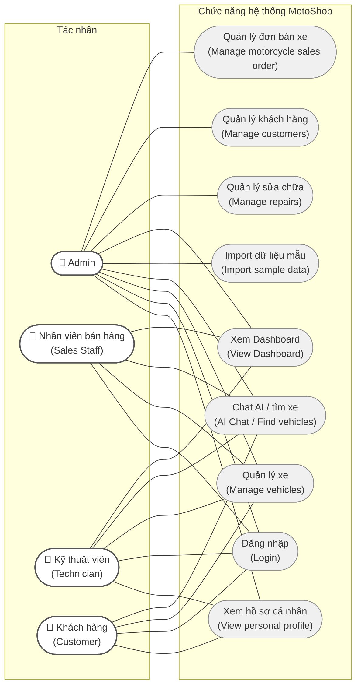

# Hình 2: Biểu đồ Use Case

> Biểu đồ Use Case UML mô tả mối quan hệ giữa 4 tác nhân và 9 chức năng chính của hệ thống MotoShop.

## Bảng phân quyền chức năng

| Chức năng | Admin | NV Bán hàng | Kỹ thuật viên | Khách hàng |
|-----------|:-----:|:-----------:|:-------------:|:----------:|
| Quản lý đơn bán xe | ✅ | ❌ | ❌ | ❌ |
| Quản lý khách hàng | ✅ | ❌ | ❌ | ❌ |
| Quản lý sửa chữa | ✅ | ❌ | ❌ | ❌ |
| Xem Dashboard | ✅ | ✅ | ✅ | ❌ |
| Import dữ liệu mẫu | ✅ | ❌ | ❌ | ❌ |
| Chat AI / tìm xe | ✅ | ✅ | ✅ | ✅ |
| Quản lý xe | ✅ | ✅ | ✅ | ✅ |
| Đăng nhập | ✅ | ✅ | ✅ | ✅ |
| Xem hồ sơ cá nhân | ✅ | ❌ | ✅ | ✅ |
