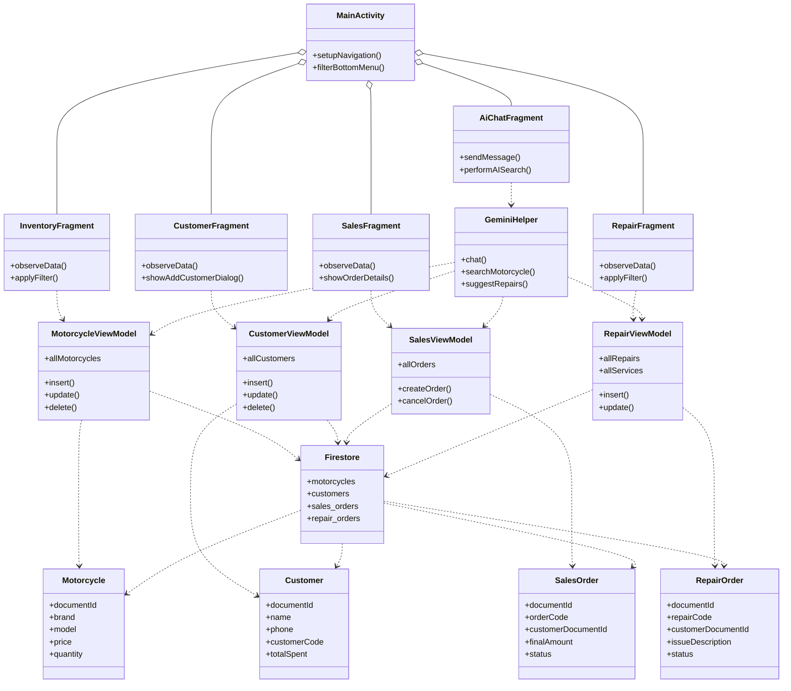

# Hình 3: Biểu đồ Lớp (Class Diagram)

> Biểu đồ Lớp UML mô tả 16 lớp chính của hệ thống MotoShop với các thuộc tính, phương thức và mối quan hệ giữa chúng.

## Mô tả mối quan hệ

| Quan hệ | Từ | Đến | Loại |
|---------|-----|------|------|
| Chứa (Aggregation) | MainActivity | 5 Fragment | `o--` |
| Phụ thuộc (Dependency) | InventoryFragment | MotorcycleViewModel | `..>` |
| Phụ thuộc (Dependency) | CustomerFragment | CustomerViewModel | `..>` |
| Phụ thuộc (Dependency) | SalesFragment | SalesViewModel | `..>` |
| Phụ thuộc (Dependency) | RepairFragment | RepairViewModel | `..>` |
| Phụ thuộc (Dependency) | AiChatFragment | GeminiHelper | `..>` |
| Phụ thuộc (Dependency) | ViewModel → Model | Motorcycle, Customer, SalesOrder, RepairOrder | `..>` |
| Phụ thuộc (Dependency) | ViewModel → Firestore | Firestore | `..>` |
| Phụ thuộc (Dependency) | GeminiHelper | 4 ViewModel | `..>` |
| Phụ thuộc (Dependency) | Firestore | 4 Model | `..>` |
