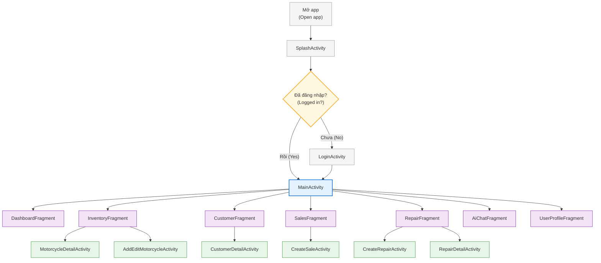

# Hình 4: Sơ đồ Điều hướng / Flowchart (Navigation Diagram)

> Sơ đồ luồng màn hình ứng dụng MotoShop với cấu trúc phân cấp cây từ trên xuống dưới, mô tả quá trình khởi động ứng dụng và điều hướng giữa các màn hình.

## Mô tả luồng điều hướng

### Luồng khởi động
1. **Mở app** → `SplashActivity` (màn hình chờ với logo MotoShop)
2. Kiểm tra trạng thái đăng nhập:
   - **Chưa đăng nhập** → `LoginActivity` → `MainActivity`
   - **Đã đăng nhập** → `MainActivity` (bỏ qua login)

### Cấp Fragment (từ MainActivity)
| Fragment | Mô tả |
|----------|-------|
| DashboardFragment | Trang tổng quan / trang chủ khách hàng |
| InventoryFragment | Danh sách kho xe |
| CustomerFragment | Quản lý khách hàng |
| SalesFragment | Quản lý đơn bán hàng |
| RepairFragment | Quản lý sửa chữa |
| AiChatFragment | Trợ lý AI / tìm xe |
| UserProfileFragment | Hồ sơ cá nhân |

### Cấp Activity chi tiết
| Từ Fragment | Đến Activity | Chức năng |
|-------------|-------------|-----------|
| InventoryFragment | MotorcycleDetailActivity | Xem chi tiết xe |
| InventoryFragment | AddEditMotorcycleActivity | Thêm/sửa xe |
| CustomerFragment | CustomerDetailActivity | Chi tiết khách hàng |
| SalesFragment | CreateSaleActivity | Tạo đơn bán hàng |
| RepairFragment | CreateRepairActivity | Tạo phiếu sửa chữa |
| RepairFragment | RepairDetailActivity | Chi tiết phiếu sửa chữa |
