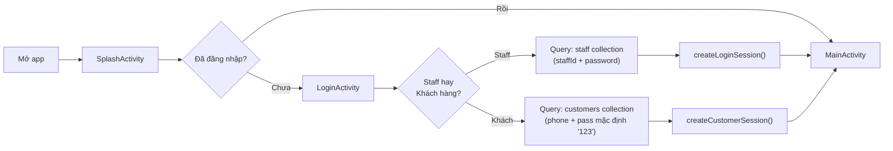
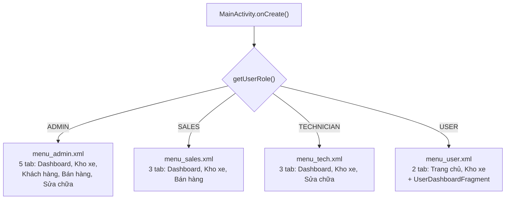
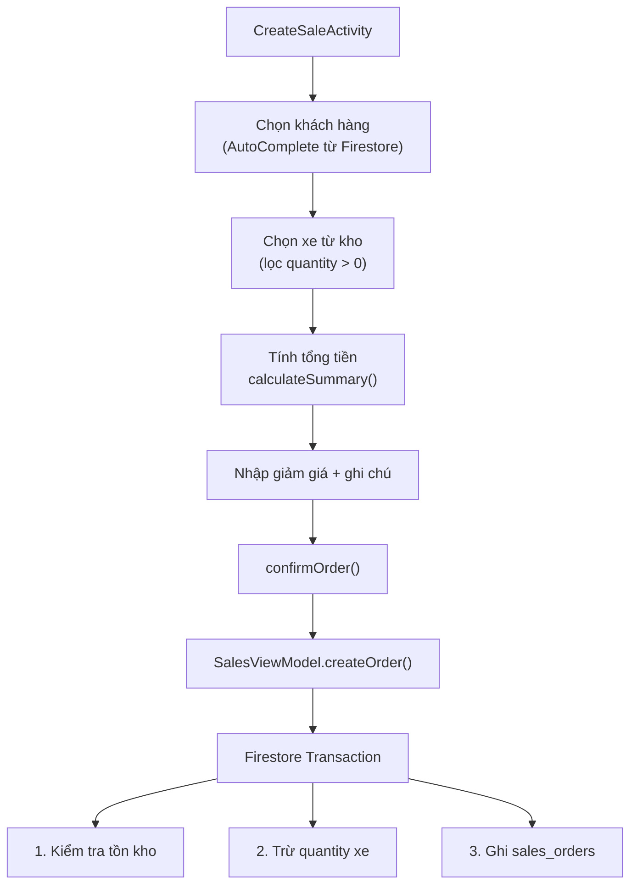
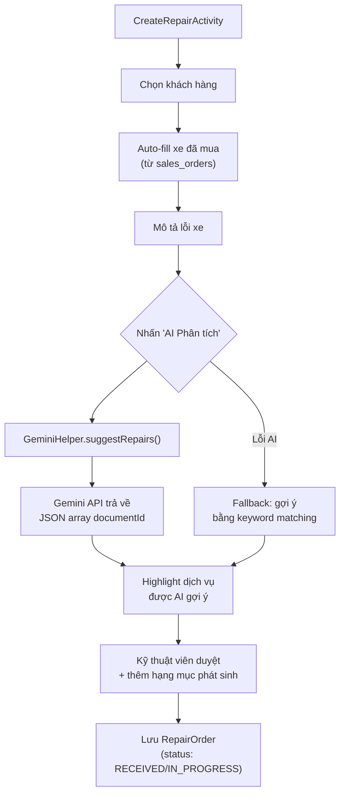
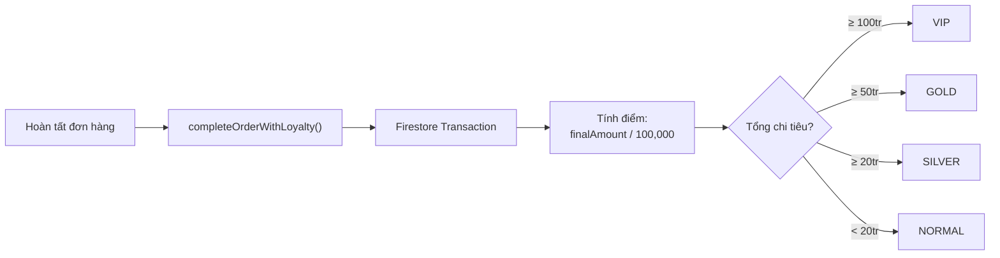
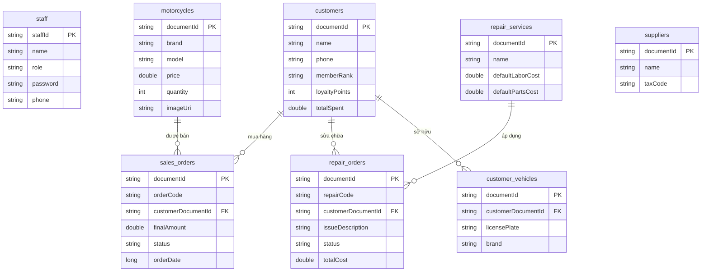

# 📖 Tài liệu Phân tích Dự án MotoShop

> **Mục đích**: Tài liệu tổng hợp để hiểu toàn bộ project, phục vụ presentation và bảo trì. Kết hợp với 4 sơ đồ kỹ thuật trong cùng thư mục.

---

## 1. Tổng quan dự án

**MotoShop** là ứng dụng Android quản lý cửa hàng xe máy, hỗ trợ:
- Quản lý kho xe, bán hàng, sửa chữa, khách hàng
- Phân quyền 4 vai trò (Admin, Sales, Technician, Customer)
- Tích hợp AI Gemini để phân tích lỗi xe và tư vấn
- Chương trình tích điểm thành viên tự động

| Thông tin | Chi tiết |
|-----------|----------|
| **Ngôn ngữ** | Java (Android) |
| **Kiến trúc** | MVVM (Model - View - ViewModel) |
| **Database** | Firebase Firestore (realtime sync) |
| **AI Engine** | Google Gemini 2.5 Flash (REST API) |
| **Min SDK** | Android 7.0 (API 24) |
| **Ngôn ngữ UI** | Tiếng Việt thuần |

---

## 2. Sơ đồ tham chiếu

| Sơ đồ | File | Nội dung |
|-------|------|----------|
| Hình 1 | `hinh1_kien_truc_luong_du_lieu.md` | Kiến trúc MVVM & luồng dữ liệu |
| Hình 2 | `hinh2_bieu_do_use_case.md` | Biểu đồ Use Case — 4 tác nhân, 9 chức năng |
| Hình 3 | `hinh3_bieu_do_lop.md` | Biểu đồ Lớp UML — 16 class chính |
| Hình 4 | `hinh4_so_do_dieu_huong.md` | Sơ đồ điều hướng màn hình |

> 💡 Mở bằng VS Code + extension **Markdown Preview Mermaid Support** (Ctrl+Shift+V)

---

## 3. Cấu trúc thư mục mã nguồn

```
com.example.motoshop/
├── MotoShopApplication.java          ← Entry point
├── data/model/                       ← 10 POJO (Firestore mapping)
│   ├── Motorcycle.java
│   ├── Customer.java
│   ├── SalesOrder.java / SalesOrderItem.java
│   ├── RepairOrder.java / RepairService.java
│   ├── CustomerVehicle.java
│   ├── Supplier.java / ImportOrder.java
│   └── Staff.java
├── viewmodel/                        ← 4 ViewModel + BaseViewModel
│   ├── BaseViewModel.java            ← Quản lý Firestore listener lifecycle
│   ├── MotorcycleViewModel.java
│   ├── CustomerViewModel.java
│   ├── SalesViewModel.java
│   └── RepairViewModel.java
├── ui/                               ← 11 package giao diện
│   ├── splash/   → SplashActivity
│   ├── login/    → LoginActivity
│   ├── main/     → MainActivity (NavHost)
│   ├── dashboard/ → DashboardFragment + UserDashboardFragment
│   ├── inventory/ → InventoryFragment, MotorcycleDetailActivity, AddEditMotorcycleActivity
│   ├── customer/  → CustomerFragment, CustomerDetailActivity
│   ├── sales/     → SalesFragment, CreateSaleActivity
│   ├── repair/    → RepairFragment, CreateRepairActivity, RepairDetailActivity
│   ├── ai/        → AiChatFragment
│   ├── staff/     → (quản lý nhân viên)
│   └── supplier/  → (quản lý nhà cung cấp)
└── utils/                            ← 12 lớp tiện ích
    ├── UserSession.java              ← SharedPreferences auth
    ├── GeminiHelper.java             ← Gemini AI REST client
    ├── FirebaseSeeder.java           ← Import dữ liệu mẫu
    ├── CurrencyFormatter.java        ← Định dạng tiền VNĐ
    ├── DateUtils.java                ← Sinh mã đơn, format ngày
    ├── LocaleHelper.java             ← Hỗ trợ đa ngôn ngữ
    ├── ThemeHelper.java              ← Dark/Light mode
    └── VNCharacterUtils.java         ← Xử lý ký tự tiếng Việt
```

---

## 4. Luồng hoạt động chính

### 4.1. Luồng khởi động & đăng nhập



**Code core — Xác thực đăng nhập**:
- `LoginActivity.java` → method `performLogin()` (dòng 86-118): Query Firestore collection `staff`, fallback sang `customers`
- `UserSession.java` → method `createLoginSession()` / `createCustomerSession()`: Lưu session vào SharedPreferences

### 4.2. Luồng phân quyền giao diện

Sau đăng nhập, `MainActivity` quyết định giao diện dựa trên `UserSession.getUserRole()`:



**Code core — Phân quyền menu**:
- `MainActivity.java` → dòng 64-73: `bottomNav.inflateMenu()` theo role
- `MainActivity.java` → dòng 56-62: Chọn `startDestination` (DashboardFragment vs UserDashboardFragment)
- `MainActivity.java` → method `setupMenuByRole()` (dòng 144-164): Ẩn/hiện drawer menu items

### 4.3. Luồng tạo đơn bán hàng



**Code core — Transaction bán hàng**:
- `SalesViewModel.java` → method `createOrder()` (dòng 215-262): Firestore Transaction đảm bảo atomic (kiểm tra tồn kho → trừ kho → ghi đơn)
- `CreateSaleActivity.java` → method `confirmOrder()` (dòng 230-273): Build SalesOrder object, gọi ViewModel

### 4.4. Luồng tạo phiếu sửa chữa (có AI)



**Code core — Tích hợp AI Gemini**:
- `GeminiHelper.java` → method `suggestRepairs()` (dòng 120-126): Xây prompt chuyên gia kỹ thuật, gửi danh sách dịch vụ dạng JSON
- `GeminiHelper.java` → method `callApi()` (dòng 93-118): OkHttp POST đến Gemini REST API, parse response
- `CreateRepairActivity.java` → method `performAiAnalysis()` (dòng 195-254): Gọi AI, parse JSON response, highlight dịch vụ gợi ý
- `CreateRepairActivity.java` → method `isMatchingService()` (dòng 279-292): Fallback keyword matching khi AI lỗi

### 4.5. Luồng tích điểm thành viên



**Code core — Loyalty system**:
- `SalesViewModel.java` → method `completeOrderWithLoyalty()` (dòng 129-169): Transaction cập nhật đồng thời status đơn hàng + điểm + hạng thành viên

---

## 5. Vai trò và Chức năng chi tiết

### 5.1. 👑 Admin (Quản trị viên)

| Chức năng | Mô tả | Code vị trí |
|-----------|-------|-------------|
| Dashboard tổng quan | Doanh thu, số đơn, tồn kho, leaderboard nhân viên | `DashboardFragment.java` → `observeData()` |
| Quản lý kho xe (CRUD) | Thêm/sửa/xóa xe, lọc theo hãng/giá/trạng thái | `InventoryFragment.java`, `AddEditMotorcycleActivity.java` |
| Quản lý khách hàng | Thêm/sửa/xóa KH, xem lịch sử mua + sửa | `CustomerFragment.java`, `CustomerDetailActivity.java` |
| Quản lý đơn bán hàng | Tạo đơn, hoàn tất (+ tích điểm), hủy (+ hoàn kho) | `CreateSaleActivity.java`, `SalesFragment.java` |
| Quản lý sửa chữa | Tạo phiếu, phân tích AI, duyệt/từ chối | `CreateRepairActivity.java`, `RepairDetailActivity.java` |
| Import dữ liệu mẫu | Upload seed_data.json lên Firestore | `FirebaseSeeder.java` → `uploadSeedData()` |
| Chat AI | Hỏi đáp tự do với Gemini | `AiChatFragment.java` |
| FAB tạo đơn nhanh | Chọn tạo đơn bán hoặc phiếu sửa | `DashboardFragment.java` → `setupFab()` |

### 5.2. 💼 Nhân viên bán hàng (Sales)

| Chức năng | Mô tả | Code vị trí |
|-----------|-------|-------------|
| Dashboard | Doanh thu cá nhân, leaderboard | `DashboardFragment.java` |
| Xem kho xe | Duyệt và xem chi tiết xe | `InventoryFragment.java`, `MotorcycleDetailActivity.java` |
| Tạo đơn bán | Chọn KH → chọn xe → tính tiền → xác nhận | `CreateSaleActivity.java` |
| Chat AI | Tìm xe phù hợp cho khách | `AiChatFragment.java` |

### 5.3. 🔧 Kỹ thuật viên (Technician)

| Chức năng | Mô tả | Code vị trí |
|-----------|-------|-------------|
| Dashboard | Số phiếu đang xử lý | `DashboardFragment.java` |
| Xem kho xe | Tra cứu thông tin xe | `InventoryFragment.java` |
| Tạo phiếu sửa chữa | Nhập lỗi → AI gợi ý → duyệt dịch vụ | `CreateRepairActivity.java` |
| Chat AI | Hỏi AI về cách sửa lỗi kỹ thuật | `AiChatFragment.java` |
| Hồ sơ cá nhân | Xem thông tin tài khoản | `UserProfileFragment.java` |

### 5.4. 👤 Khách hàng (Customer / User)

| Chức năng | Mô tả | Code vị trí |
|-----------|-------|-------------|
| Trang chủ riêng | Chào hỏi, hạng thành viên, điểm tích lũy | `UserDashboardFragment.java` → `observeData()` |
| Duyệt kho xe | Xem danh sách xe, chi tiết, chia sẻ | `InventoryFragment.java`, `MotorcycleDetailActivity.java` |
| Yêu thích xe | Toggle favorite, lưu vào Firestore | `UserDashboardFragment.java` → `onFavoriteClicked()` |
| Lịch sử mua hàng | Xem đơn hàng của mình | `UserDashboardFragment.java` → `salesAdapterFilter()` |
| Lịch sử sửa chữa | Xem phiếu sửa chữa của mình | `UserDashboardFragment.java` → `repairAdapterFilter()` |
| Chat AI | Tìm xe, hỏi tư vấn | `AiChatFragment.java` |

---

## 6. Bảng phân quyền tổng hợp

| Chức năng | Admin | Sales | Tech | Customer |
|-----------|:-----:|:-----:|:----:|:--------:|
| Dashboard (quản lý) | ✅ | ✅ | ✅ | ❌ |
| Dashboard (khách hàng) | ❌ | ❌ | ❌ | ✅ |
| Xem kho xe | ✅ | ✅ | ✅ | ✅ |
| Thêm/Sửa/Xóa xe | ✅ | ❌ | ❌ | ❌ |
| Quản lý khách hàng | ✅ | ❌ | ❌ | ❌ |
| Tạo đơn bán hàng | ✅ | ✅ | ❌ | ❌ |
| Hoàn tất/Hủy đơn | ✅ | ✅ | ❌ | ❌ |
| Tạo phiếu sửa chữa | ✅ | ❌ | ✅ | ❌ |
| Cập nhật phiếu sửa | ✅ | ❌ | ✅ | ❌ |
| Yêu thích xe | ❌ | ❌ | ❌ | ✅ |
| Xem lịch sử cá nhân | ❌ | ❌ | ❌ | ✅ |
| Import dữ liệu mẫu | ✅ | ❌ | ❌ | ❌ |
| Chat AI Gemini | ✅ | ✅ | ✅ | ✅ |
| Hồ sơ cá nhân | ✅ | ❌ | ✅ | ✅ |

---

## 7. Firebase Firestore Collections



### Quy tắc đặt Document ID

| Collection | Format | Ví dụ |
|------------|--------|-------|
| staff | `staffId` gốc | `AD01`, `SL01`, `KT01` |
| customers | `KH_[phone]` | `KH_0901234567` |
| motorcycles | `[brand]_[model]_[year]` | `honda_air_blade_125_2024` |
| sales_orders | `DH_[yyMMdd]_[stt]` | `DH_260503_001` |
| repair_orders | `SC_[yyMMdd]_[stt]` | `SC_260503_001` |
| repair_services | `DV_[TEN]` hoặc `PT_[TEN]` | `DV_THAY_NHOT`, `PT_LOC_GIO` |
| suppliers | `NCC_[TEN]` | `NCC_HONDA_VIET_NAM` |

---

## 8. Tính năng nổi bật (Điểm nhấn Presentation)

### 🤖 8.1. Tích hợp AI Gemini

- **Chat tự do**: `AiChatFragment` + `GeminiHelper.chat()` — lưu lịch sử hội thoại
- **Phân tích lỗi xe**: `GeminiHelper.suggestRepairs()` — prompt chuyên gia, trả về JSON service IDs
- **Tìm xe thông minh**: `GeminiHelper.searchMotorcycle()` — mô tả tự nhiên → gợi ý xe phù hợp
- **Fallback an toàn**: Khi AI lỗi/timeout → dùng keyword matching cục bộ

> 📍 **Core file**: `utils/GeminiHelper.java` (133 dòng)

### 💎 8.2. Hệ thống tích điểm thành viên

- Tự động tính khi hoàn tất đơn: `100,000đ = 1 điểm`
- 4 hạng: NORMAL → SILVER (20tr) → GOLD (50tr) → VIP (100tr)
- Sử dụng **Firestore Transaction** đảm bảo tính nhất quán

> 📍 **Core file**: `viewmodel/SalesViewModel.java` → `completeOrderWithLoyalty()` (dòng 129-169)

### 🔄 8.3. Realtime Sync với Firestore

- Tất cả ViewModel dùng `addSnapshotListener` — dữ liệu cập nhật realtime
- `BaseViewModel` quản lý lifecycle listener tự động (tránh memory leak)

> 📍 **Core file**: `viewmodel/BaseViewModel.java`

### 🛡️ 8.4. Transaction an toàn

- **Bán hàng**: Kiểm tra tồn kho → trừ kho → ghi đơn (atomic)
- **Hủy đơn**: Hoàn kho tự động + ghi lý do hủy
- **Tích điểm**: Cập nhật đồng thời đơn hàng + khách hàng

> 📍 **Core file**: `viewmodel/SalesViewModel.java` → `createOrder()`, `cancelOrder()`, `completeOrderWithLoyalty()`

### 🎨 8.5. Giao diện phân quyền động

- **4 bộ menu** Bottom Navigation khác nhau theo role
- **2 Dashboard** riêng biệt: nhân viên (quản lý) vs khách hàng (tiêu dùng)
- **Drawer menu** ẩn/hiện theo quyền

> 📍 **Core file**: `ui/main/MainActivity.java` → `onCreate()` (dòng 56-73), `setupMenuByRole()` (dòng 144-164)

---

## 9. Tài khoản demo đăng nhập

| Vai trò | Mã đăng nhập | Mật khẩu |
|---------|-------------|----------|
| Admin | `AD01` | `1111` |
| Nhân viên bán hàng | `SL01` | `2222` |
| Kỹ thuật viên | `KT01` | `3333` |
| Khách hàng | `[SĐT trong DB]` | `123` |

> 📍 **Core file**: `ui/login/LoginActivity.java` → `setDemoAccount()` (dòng 71-75), `switchToCustomerMode()` (dòng 78-83)

---

## 10. Tóm tắt Core Code quan trọng cho Presentation

| # | Chủ đề | File | Method/Dòng |
|---|--------|------|-------------|
| 1 | Đăng nhập & phân quyền | `LoginActivity.java` | `performLogin()` (L86-118) |
| 2 | Phân quyền giao diện | `MainActivity.java` | `onCreate()` (L56-73) |
| 3 | Kiến trúc MVVM | `BaseViewModel.java` | `registerListener()` |
| 4 | Realtime data | `MotorcycleViewModel.java` | `listenToFirebase()` (L66-80) |
| 5 | Tạo đơn bán (Transaction) | `SalesViewModel.java` | `createOrder()` (L215-262) |
| 6 | Hủy đơn + hoàn kho | `SalesViewModel.java` | `cancelOrder()` (L171-213) |
| 7 | Tích điểm thành viên | `SalesViewModel.java` | `completeOrderWithLoyalty()` (L129-169) |
| 8 | AI phân tích lỗi xe | `GeminiHelper.java` | `suggestRepairs()` (L120-126) |
| 9 | AI chat đa lượt | `GeminiHelper.java` | `chat()` (L60-80) |
| 10 | Xử lý AI response | `CreateRepairActivity.java` | `performAiAnalysis()` (L195-254) |
| 11 | Fallback keyword | `CreateRepairActivity.java` | `isMatchingService()` (L279-292) |
| 12 | Seed dữ liệu mẫu | `FirebaseSeeder.java` | `uploadSeedData()` (L21-46) |
| 13 | Session management | `UserSession.java` | Toàn bộ file (92 dòng) |
| 14 | Dashboard khách hàng | `UserDashboardFragment.java` | `observeData()` (L174-215) |
| 15 | Yêu thích xe | `UserDashboardFragment.java` | `onFavoriteClicked()` (L127-148) |

---

> 📅 Cập nhật lần cuối: 03/05/2026
